# Transcriptomics

# Mapping 
***
## 1. Alignment step


> We need to first figure out where the sequences originated from in the genome, so we can then determine to which genes they belong. \
> When a reference genome for the organism is available, this process is known as **aligning** or **“mapping”** the reads to the reference. 

```STAR tool``` was used 
Drosophila_melanogaster.BDGP6.87.gtf was our reference genome and was retrieved from data library
**[click here for the link](https://zenodo.org/record/4541751/files/Drosophila_melanogaster.BDGP6.87.gtf)**
 The input files were cutadapt outputs with PairedEnd reads of sample GSM461177 and GSM461180
 
    - Custom or built-in reference genome”: Use a built-in index
    - “Reference genome with or without an annotation”: use genome reference without builtin gene-model
    - “Select reference genome”: Fly (_Drosophila Melanogaster_): dm6 
    - “Gene model (gff3,gtf) file for splice junctions”: the imported _Drosophila_melanogaster.BDGP6.87.gtf_
    - “Length of the genomic sequence around annotated junctions”: 36
    - This parameter should be length of reads - 1 (read length of fastq file was 37 so we put 36)
      
 <h3 align="center">
 
 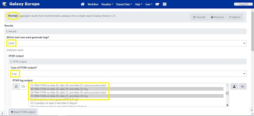 
 
</h3>
    
 MultiQC: to aggregate the STAR logs
 
 <h3 align="center">
 
 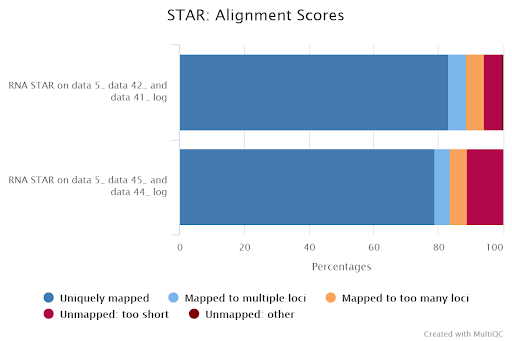

</h3>
    
 Results
 <h3 align="center">
 
 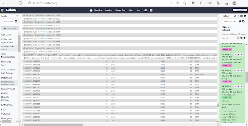

</h3>
    
 More than 83% for GSM461177 and more than 79% for GSM461180. We can proceed with the analysis since only percentages below 70% should be investigated for potential contamination.
## 2. BAM File Inspection

<h3 align="center">
 
 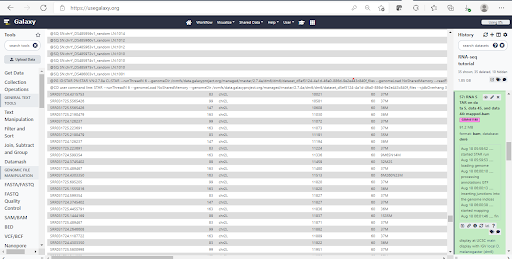
 
 </h3>
 
<h3 align="center">
 
 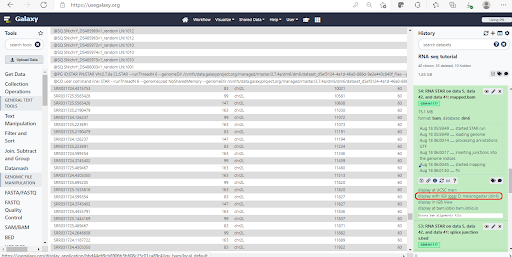
 
  </h3>
    
## 3. Further Inspection on IGV (mouse over for description)

<h3 align="center">
 
   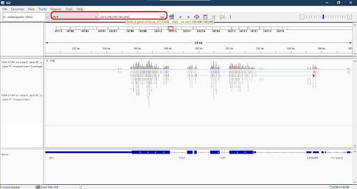

 </h3>

<h3 align="center">
 
 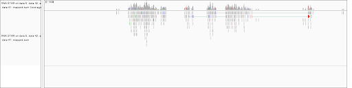
 
</h3>

<h3 align="center">
 
 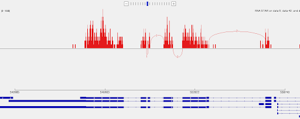

</h3>
    
## 4.Counting the number of reads per annotated gene
Estimation of the strandness:
First, we used Convert GTF to BED12 Tool: to convert the GTF file to BED
   
    
Then Infer Experiment Tool: to determine the library strandness:
    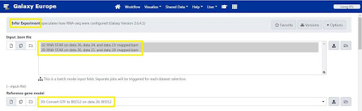
    
Results: 
    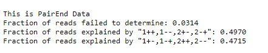
    
Since the two “Fractions of reads explained by” the numbers are close to each other or nearly equal, we conclude that the library is not a ```strand-specific dataset (unstranded).```
## 5. Counting reads per genes;
```FeatureCounts Tool:``` was used to count the number of reads per gene
The input files are the mapped bam files and also the annotation file which is the Drosophilla melanongaster .gtf file.
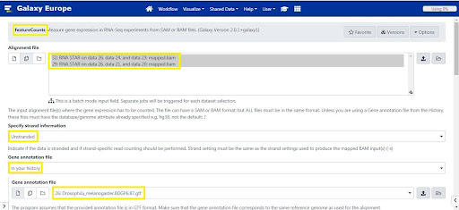
    
 ```MultiQC Tool:``` was used to aggregate the report
  
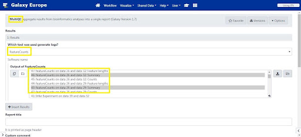
Results:
  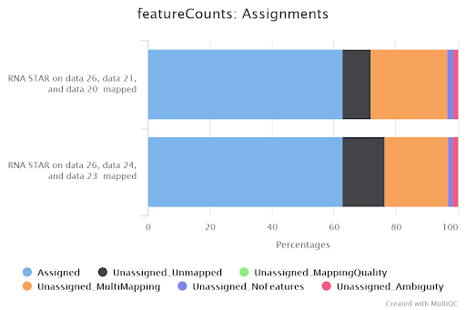
    
Around 63% of the reads have been assigned to genes: this quantity is good enough.If the percentage falls below 50%, you should investigate where your reads are mapping (inside genes or not, with IGV) and then check that the annotation corresponds to the correct reference genome version.

<h2> TEAM CONTRIBUTORS </h2>
<table>
  <tr>
   <td><strong>Mapping</strong>
   </td>
   <td>Yasmin, Dawoud, Saket, Bandana, Nirvana, Johny, Favour, Ankita, Eman
   </td>
  </tr>
  <tr>
   <td>Inspection of Mapping results
   </td>
   <td>Yasmeen, Nirvana, Dawoud, Bandana
   </td>
  </tr>
  <tr>
   <td>Counting the number of reads per annotated gene
   </td>
   <td>Yasmeen, Saket, Johny
   </td>
  </tr>
  <tr>
   <td>Estimation of the strandness
   </td>
   <td>Eman, Saket
   </td>
  </tr>
  <tr>
   <td>
Counting reads per genes


   </td>
   <td>Ankita, Favour, Nirvana
   </td>
  </tr>
  <tr>
   <td>
Creating Readme


   </td>
   <td>Saket, Yasmeen, Johny
   </td>
  </tr>
  <tr>
   <td>
Documentation


   </td>
   <td>Eman, Yasmein, Dawoud
   </td>
  </tr>
</table>


